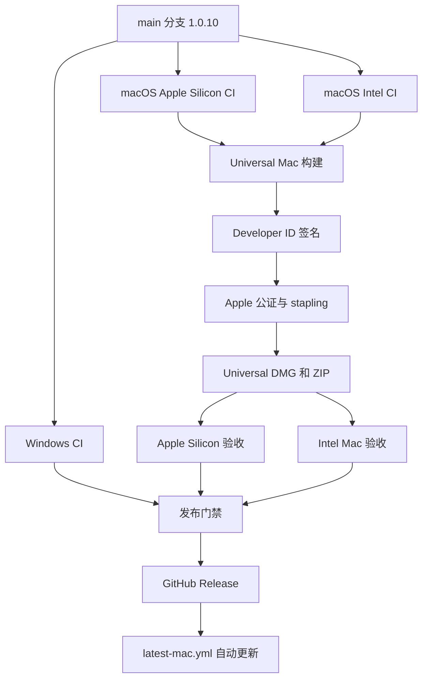

# DeepSeek Harness Desktop macOS 发布计划

本文定义将当前 Windows 版 DeepSeek Harness Desktop 扩展为可正式分发、可验证、可升级的 macOS 版本的执行方案。首个 Mac 正式版目标版本为 `1.0.10`，支持 macOS 13 及以上，优先发布一个同时支持 Apple Silicon 与 Intel Mac 的 Universal 应用。

> 重要限制：截至 2026-08-23，仓库仅完成 Windows 1.0.9 构建和验证。当前没有 Mac 安装包、Mac CI、Apple 签名、公证或真实 Mac 运行证据。Windows 电脑不能完成可信的 macOS 打包验收，最终发布必须由 GitHub macOS runner 和真实 Mac 设备共同验证。

## 发布目标

| 项目 | 目标 |
| --- | --- |
| 首个版本 | `1.0.10` |
| 最低系统 | macOS 13 Ventura |
| CPU | Apple Silicon `arm64`、Intel `x64` |
| 首选包形态 | Universal `DMG` + Universal `ZIP` |
| 下载方式 | GitHub Release |
| 更新方式 | `electron-updater` + `latest-mac.yml` |
| 签名 | Developer ID Application |
| 公证 | Apple Notary Service + stapling |
| 商店 | 第一阶段不发布 Mac App Store |

发布物名称统一为：

```text
DeepSeek-Harness-Desktop-1.0.10-universal.dmg
DeepSeek-Harness-Desktop-1.0.10-universal.zip
latest-mac.yml
SHA256SUMS.txt
```

现有 Windows 1.0.9 安装包和发布历史继续保留，不覆盖、不删除，也不使用同一版本号重新发布不同内容。

## 当前状态与缺口

当前仓库中的事实如下：

| 文件 | 当前状态 | macOS 缺口 |
| --- | --- | --- |
| `apps/dsh-desktop/electron-builder.yml` | 仅配置 Windows NSIS x64 | 缺少 `mac`、`dmg`、签名、公证和 Universal 配置 |
| `apps/dsh-desktop/package.json` | 只有 `pack:win` | 缺少 `pack:mac` 和 Mac 包校验命令 |
| 根 `package.json` | `desktop:pack` 固定调用 Windows | 需要拆分平台命令，避免名称误导 |
| `.github/workflows/desktop-ci.yml` | 仅运行 `windows-latest` | 缺少 Apple Silicon 与 Intel Mac CI |
| `.github/workflows/desktop-release.yml` | 仅构建和发布 Windows EXE | 缺少 Mac 构建、签名、公证、验收和发布物汇总 |
| `src/electron-app.mjs` | 自动更新只在 `win32` 启用 | 需要为 `darwin` 启用签名更新链路 |
| `scripts/after-pack.cjs` | 只处理 Windows 打包目录 | 需要确认 Mac 原生模块完整性，不能套用 Windows 清理规则 |
| `scripts/verify-package.mjs` | 以 Windows 包结构为主 | 需要新增 `.app`、Mach-O 架构和更新元数据检查 |

当前仓库仍是私有仓库。私有 GitHub Release 对普通外部用户的自动更新不可用，因此正式对外发布前必须将更新仓库设为公开，或者改用一个公开的独立更新源。仓库可见性属于高影响操作，应由仓库所有者在正式发布前明确执行。

## 发布架构



发布门禁必须同时依赖 Windows、Apple Silicon、Intel Mac 三条验证链。任一链失败时，不创建正式 Release，也不更新 `latest-mac.yml`。

## 准备 Apple 发布凭据

正式发布前需要有效的 Apple Developer Program 账户和 Developer ID Application 证书。GitHub 仓库中配置以下 Actions secrets：

| Secret | 内容 | 用途 |
| --- | --- | --- |
| `MAC_CSC_LINK` | Base64 编码的 Developer ID Application `.p12` | 应用代码签名 |
| `MAC_CSC_KEY_PASSWORD` | `.p12` 密码 | 导入签名证书 |
| `APPLE_API_KEY` | Base64 编码的 App Store Connect `.p8` | 公证认证 |
| `APPLE_API_KEY_ID` | App Store Connect Key ID | 公证认证 |
| `APPLE_API_ISSUER` | App Store Connect Issuer ID | 公证认证 |
| `APPLE_TEAM_ID` | Apple Developer Team ID | 归属校验和诊断 |

禁止把证书、密码、`.p8`、Apple ID 或 GitHub token 写入仓库、日志、安装包和审查报告。正式发布工作流必须在任何构建开始前检查 secrets 是否齐全；缺失时直接失败。

## 修改打包配置

在 `apps/dsh-desktop/electron-builder.yml` 增加 Mac 配置，Windows 配置保持不变。目标配置如下：

```yaml
mac:
  icon: build/icon.icns
  category: public.app-category.developer-tools
  minimumSystemVersion: '13.0'
  hardenedRuntime: true
  notarize: true
  entitlements: build/entitlements.mac.plist
  entitlementsInherit: build/entitlements.mac.inherit.plist
  target:
    - target: dmg
      arch:
        - universal
    - target: zip
      arch:
        - universal
  artifactName: DeepSeek-Harness-Desktop-${version}-${arch}.${ext}

dmg:
  title: DeepSeek Harness Desktop ${version}
  artifactName: DeepSeek-Harness-Desktop-${version}-${arch}.${ext}
```

`ZIP` 不能省略。`electron-updater` 的 Mac 更新链路需要 ZIP，并由 electron-builder 生成 `latest-mac.yml`。

从当前 `build/icon.png` 生成 `build/icon.icns`，检查以下尺寸均存在且边缘没有被裁切：

```text
16x16
32x32
64x64
128x128
256x256
512x512
1024x1024
```

新增 `build/entitlements.mac.plist` 和 `build/entitlements.mac.inherit.plist`。第一版只启用 Electron/V8 运行所需的最小 entitlement，不启用 Mac App Store sandbox。若原生模块在 Hardened Runtime 下被拒绝，应根据 `codesign` 或公证日志增加精确 entitlement，不能直接关闭 Hardened Runtime。

## 增加构建命令

在 `apps/dsh-desktop/package.json` 增加：

```json
{
  "scripts": {
    "pack:mac": "electron-builder --mac dmg zip --universal --publish never",
    "pack:verify:mac": "node scripts/verify-package-mac.mjs"
  }
}
```

根目录命令拆分为：

```json
{
  "scripts": {
    "desktop:pack:win": "pnpm --filter @deepseek-ai/dsh-desktop pack:win",
    "desktop:pack:mac": "pnpm --filter @deepseek-ai/dsh-desktop pack:mac"
  }
}
```

为兼容已有调用，`desktop:pack` 在 1.0.10 内暂时继续指向 Windows，并在 README 中标明；待后续发布再决定是否删除这个兼容别名。

## 处理运行时与原生依赖

Mac 构建必须重点检查以下依赖在两种架构中的实际二进制：

```text
koffi
node-pty
sharp
@vscode/ripgrep
DeepSeek DSH Runtime 的原生模块
```

Universal 构建完成后，对 `.app` 内所有 `.node`、Mach-O 可执行文件和 Electron Helper 执行架构检查：

```bash
find "dist/mac-universal/DeepSeek Harness Desktop.app" -type f -print0 \
  | xargs -0 file \
  | grep -E 'Mach-O|universal binary'

lipo -archs "dist/mac-universal/DeepSeek Harness Desktop.app/Contents/MacOS/DeepSeek Harness Desktop"
```

主程序必须同时报告 `x86_64 arm64`。每个运行时会实际加载的原生模块也必须包含匹配架构。

如果 Universal 合并因原生模块失败，采用以下固定回退方案：

1. `macos-15` runner 原生构建 `arm64`。
2. `macos-15-intel` runner 原生构建 `x64`。
3. 分别生成带架构后缀的 DMG 和 ZIP。
4. 在自动更新启用前，验证一个 `latest-mac.yml` 能同时列出并正确选择两种架构的 ZIP。
5. 在架构选择验证通过前，Mac 版只提供手动下载，不启用自动更新。

不能在 Apple Silicon runner 上安装一次依赖后直接把同一 `node_modules` 当作 Intel 原生包发布，也不能只依赖 Rosetta 证明 Intel 包可用。

## 适配 macOS 应用行为

修改 `apps/dsh-desktop/src/electron-app.mjs` 时遵守以下边界：

- 将自动更新启用条件从仅 `win32` 扩展为已打包的 `win32` 或 `darwin`。
- Windows 的 NSIS 清理脚本、更新收据和 PowerShell 进程检测继续只在 Windows 调用。
- Mac 更新使用签名 ZIP，由 `electron-updater` 完成下载、校验、退出和替换。
- `window-all-closed` 在 macOS 上不直接退出进程；Dock 图标被点击时重新打开主窗口。
- “退出”命令必须真正停止 Harness Runtime、托盘和后台进程。
- 深链接 `dsh://`、文件打开、Downloads 和 workspace 路径使用平台 API，不拼接 Windows 路径。
- 用户安装的插件继续保存在 DSH Profile 中，应用升级不得覆盖 dependencies、bundles、patch 或 lockfile。

Mac 版第一次启动时不应自动打开浏览器，也不应显示 Windows 专用菜单或安装提示。

## 扩展 GitHub Actions

### 日常 CI

在 `.github/workflows/desktop-ci.yml` 保留现有 Windows job，并增加：

| Job | Runner | 验证内容 |
| --- | --- | --- |
| `mac-arm64-test` | `macos-15` | Apple Silicon 安装依赖、单元测试、Runtime 启停、arm64 目录包冒烟 |
| `mac-x64-test` | `macos-15-intel` | Intel 安装依赖、单元测试、Runtime 启停、x64 目录包冒烟 |

两个 job 都必须执行：

```bash
pnpm install --frozen-lockfile
pnpm audit --prod
pnpm typecheck
pnpm test
pnpm --filter @deepseek-ai/dsh-desktop test:runtime-provider:e2e
```

日常 CI 使用未发布的目录包验证功能，不要求 Apple 公证，避免每次提交消耗公证请求。

### 预发布构建

增加 `workflow_dispatch` 入口，生成不创建 Release 的候选 Mac 包。候选包保存在 GitHub Actions Artifacts 中，用于真实 Mac 验收。候选构建也必须签名和公证，确保测试结果与正式发布一致。

### 正式发布

将 `.github/workflows/desktop-release.yml` 拆成以下门禁：

1. 校验 tag、版本号、仓库可见性和全部签名 secrets。
2. Windows job 生成并验证 EXE、blockmap、`latest.yml`。
3. Mac job 生成 Universal DMG、ZIP、`latest-mac.yml`。
4. Mac job 验证签名、公证、stapling 和二进制架构。
5. Windows、Apple Silicon、Intel Mac 验收全部成功后，唯一的 publish job 创建 GitHub Release。
6. publish job 计算并上传统一的 `SHA256SUMS.txt`。

不要让多个架构 job 同时上传同名 `latest-mac.yml`，否则最后写入者可能覆盖另一架构的更新信息。

## 增加 Mac 包校验器

新增 `apps/dsh-desktop/scripts/verify-package-mac.mjs`，至少验证：

- `.app`、DMG、ZIP、`latest-mac.yml` 均存在。
- 版本号与根 `package.json`、桌面 `package.json` 一致。
- `@deepseek-ai/dsh` 精确为仓库声明版本。
- 内置 pnpm 版本与 lockfile 一致。
- 应用只包含官方 Runtime，不重新带回已删除的第三方扩展集合。
- `Info.plist` 中 bundle identifier 为 `ai.deepseek.harness.desktop`。
- `LSMinimumSystemVersion` 为 `13.0`。
- 主程序包含 `x86_64` 和 `arm64`。
- ZIP 文件名和 SHA512 与 `latest-mac.yml` 一致。
- Mac 包中不存在 Windows EXE、NSIS 安装脚本和 PowerShell 更新清理入口。

签名和公证使用系统工具验证：

```bash
codesign --verify --deep --strict --verbose=2 \
  "dist/mac-universal/DeepSeek Harness Desktop.app"

spctl --assess --type execute --verbose=4 \
  "dist/mac-universal/DeepSeek Harness Desktop.app"

xcrun stapler validate \
  "dist/DeepSeek-Harness-Desktop-1.0.10-universal.dmg"
```

预期结果是 `codesign` 无错误、`spctl` 显示 accepted、`stapler` 显示验证成功。

## 真实 Mac 验收

至少准备一台 Apple Silicon Mac 和一台 Intel Mac；两台设备都不预装 Node.js、pnpm 或 DSH 开发环境。

每台设备执行以下验收：

1. 从 GitHub 下载 DMG，确认 Gatekeeper 不报“应用已损坏”或“无法验证开发者”。
2. 挂载 DMG，将应用拖入 `/Applications` 后启动。
3. 确认鲸鱼图标、Dock、窗口、菜单、Help 和设置正常。
4. 确认不会额外打开浏览器或终端窗口。
5. 新建对话，配置模型，选择包含中文和空格的工作区路径。
6. 执行文件读取、写入、搜索和任务工具。
7. 通过官方插件管理界面安装一个插件，退出应用后重新启动，确认插件仍能加载。
8. 删除该插件，重启后确认功能消失且 Profile 未损坏。
9. 点击窗口关闭按钮，确认行为符合 Mac 约定；通过菜单“退出”后确认 Runtime 和后台进程全部结束。
10. 重启系统后再次启动，确认用户数据、会话、模型设置和插件状态保留。
11. 从 1.0.10 升级到专用测试版本 1.0.11，确认更新下载、签名校验、退出替换和重启完整通过。
12. 删除 `/Applications/DeepSeek Harness Desktop.app`，确认应用本体可卸载；用户数据仅在文档明确指导下单独删除。

任何一台设备失败都不得发布正式版。

## 发布步骤

1. 从最新 `main` 创建 `release/macos-1.0.10`。
2. 将根版本和桌面版本从 `1.0.9` 升至 `1.0.10`，保持 DSH Runtime 版本独立固定。
3. 完成 Mac 配置、图标、entitlements、脚本和工作流修改。
4. 运行 Windows 回归，确认新增 Mac 配置没有破坏 Windows 1.0.9 已验证能力。
5. 触发 Mac 预发布工作流，下载签名且已公证的候选包。
6. 在 Apple Silicon 和 Intel 真机完成全部验收。
7. 合并到 `main`，确认三平台 CI 全绿。
8. 创建并推送 tag `desktop-v1.0.10`。
9. 等待 release workflow 完成，确认 GitHub Release 同时包含 Windows 和 Mac 发布物。
10. 从未登录 GitHub 的浏览器测试公开下载链接。
11. 检查 `latest.yml` 与 `latest-mac.yml`，确认版本和文件哈希均为 1.0.10。
12. 保留构建日志、签名验证、公证日志和真机验收记录。

## 回滚方案

- tag 创建前失败：不创建 Release，修复后重新跑候选构建。
- Release 仍为 draft 时失败：删除 draft 中错误附件，不能改写已公开的正式附件。
- 1.0.10 已公开但无法启动：立即将 Release 标为 pre-release，并发布更高版本 1.0.11；不要用不同文件覆盖 1.0.10。
- 自动更新元数据错误：撤下错误的 `latest-mac.yml`，修复后发布更高版本，避免已下载客户端进入哈希冲突。
- Mac 变更导致 Windows 回归：回退 Mac 相关提交，保留 Windows 1.0.9 Release 和 tag 不变。
- Apple 凭据泄露：立即撤销 App Store Connect Key 和证书，删除 GitHub secrets，重新签发后再发布。

## 发布完成标准

只有同时满足以下条件，才能对外宣布 macOS 版本可用：

- Apple Silicon 和 Intel CI 均通过。
- Universal 主程序及所有实际加载的原生模块架构正确。
- `codesign`、`spctl` 和 `stapler` 验证全部通过。
- DMG、ZIP 和 `latest-mac.yml` 属于同一次构建。
- 两种 Mac 真机均完成安装、对话、工作区、插件、重启和退出验收。
- 1.0.10 到 1.0.11 的真实自动更新测试通过。
- Windows CI 继续通过。
- GitHub Release 可匿名下载，仓库或更新源对外可访问。
- Release 中包含 SHA256 校验文件和清晰的安装说明。

## 参考资料

- [GitHub-hosted runner 架构与标签](https://docs.github.com/en/actions/how-tos/write-workflows/choose-where-workflows-run/choose-the-runner-for-a-job)
- [electron-builder macOS 配置](https://www.electron.build/docs/mac/)
- [electron-builder macOS 签名与公证](https://www.electron.build/docs/notarization/)
- [electron-builder 自动更新](https://www.electron.build/docs/features/auto-update/)
- [Electron 版本支持策略](https://www.electronjs.org/docs/latest/tutorial/electron-timelines)
