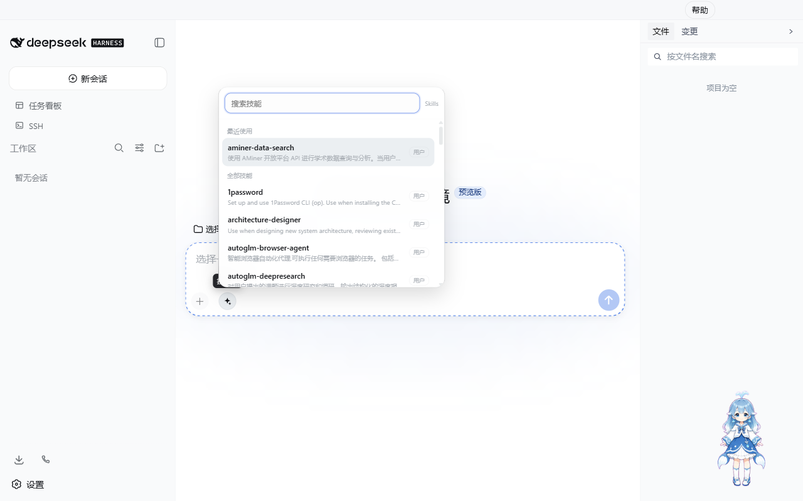
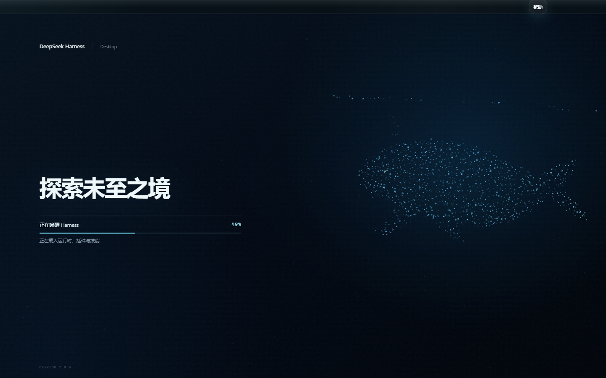
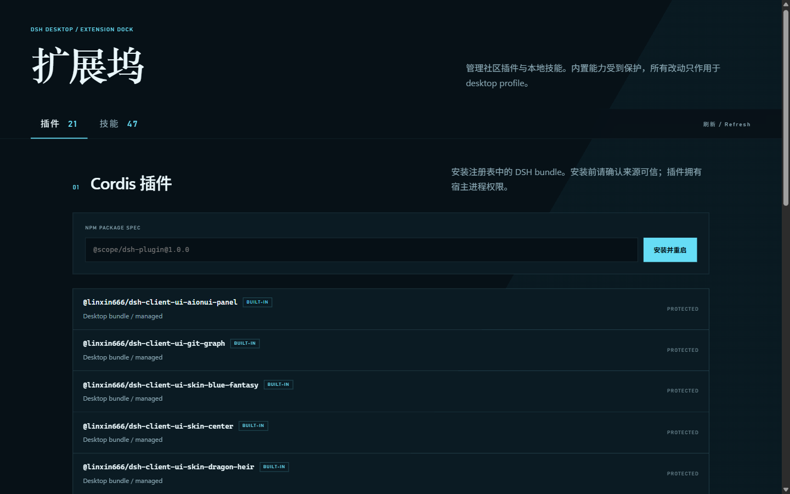

# DeepSeek Harness Desktop

## Architecture

The desktop application is a thin lifecycle and security layer around the official DSH host. Electron starts `@deepseek-ai/dsh` with `--profile desktop --port 0`, waits for the official loopback URL line, probes HTTP readiness, and then loads that URL into the main window. The Web application, protocols, data paths, tools, and plugin system remain DSH implementations.

The DSH home remains `DSH_HOME` or `~/.dsh`. The desktop app runs the managed `~/.dsh/profiles/desktop` profile, which composes `@deepseek-ai/dsh-base`, `@deepseek-ai/dsh-web-app`, `@linxin666/dsh-web-ui-all`, `@tencent-connect/dsh-qqbot`, `dshmarket`, `dsh-codex-connect`, and `reasoning-slider` while preserving community bundles already added to that profile. Packaged plugin directories are linked into the profile's `node_modules`; this is runtime package resolution, not a second configuration store. Existing default profiles are not changed.

## Included desktop capabilities

| Area | Behavior |
| --- | --- |
| Runtime | Official DSH host, random loopback port, HTTP readiness probe, graceful stop, bounded automatic restart; Windows window suppression stays at spawn level rather than the PowerShell command payload |
| Web surface | Original DSH Web application and complete dsh-web-ui plugin/skin aggregate |
| Conversation continuity | FIFO next-turn queue, automatic continuation after cancellation, normalized user-cancellation feedback |
| Model recovery | Bounded backoff for rate limits, timeouts, network loss, and retryable server errors; immediate manual cancellation |
| Recovery | Critical-file preflight, startup status, sanitized recent error, retry, profile repair, logs, exit; legacy empty patch and readiness/IPC failures cannot leave a permanent 8% screen |
| Plugins | Actual version inventory, Desktop-managed built-ins, lazy community update checks, atomic exact-version batches, compatibility declarations, profile lock diagnostics, progress, rollback |
| Presets | Review-only file ingress, bounded archive validation, integrity and trust summary, staged multi-surface rollback |
| Skills | Project/DSH/Agents root discovery, safe folder import, searchable conversation menu, recent-use ordering, full keyboard control |
| Reasoning | Sticky disclosure control keeps long reasoning collapsible without scrolling back to its start |
| SSH operations | Three-second Linux telemetry for CPU, memory, disk, load, processes, and failed services, plus confirmed process and systemd actions |
| Window | Single instance, persisted visible main geometry, native menu, download destination prompt; movable/resizable settings panel with minimum and persisted bounds; explicit quit/minimize-to-tray/ask close behavior |
| Community | Help-menu QQ group QR and one-click join, direct GitHub issue feedback |
| Updates | GitHub Releases first and by default, background download, user-confirmed restart/install, release notes, taskbar progress, QR-backed user-group installer fallback |
| Update handoff | Token-bound shutdown receipt v2, verified runtime/extension quiescence, constrained legacy cleanup fallback |
| Renderer bridge | Contract v1.2 capability discovery, structured notifications, browser-safe Desktop client SDK, split main/extension preloads, sender-identity enforcement |
| OS integration | Strict `dsh://` route allowlist, `.dshpreset` preview association, deduplicated foreground-aware notifications, and main-window-only workspace file opening |
| Task Board | Host-owned v3 Projects/Task Runs/Evidence ledger, copy-first v2 migration, explicit Worktree review, ID-only Host routes, SSE synchronization, and an opt-in durable Host scheduler with browser fallback |
| Visual system | Solid native/injected title-bar alignment, system-style Extension Dock, bounded particle-whale startup surface, page-aware full-interface particle theme |
| Security | Sandbox, context isolation, no Node integration, per-window preload APIs, sender registry, loopback navigation allowlist, denied permissions |

## Windows startup and recovery

The Windows invocation retains the PowerShell wrapper where it is needed for streaming Runtime output, but it does not pass `-WindowStyle Hidden`. On Windows PowerShell 5.1, that flag combined with Electron Node mode and no console handle can cause the Runtime (including `--version`) to exit silently with `0xFFFFFFFF`; Electron's spawn-level `windowsHide` is the single window-suppression mechanism.

Startup also normalizes legacy empty-object, empty-list, and comment-only patch files before profile resolution. A status-subscription or startup IPC failure is converted to a recoverable startup state rather than leaving the renderer at its initial 8% progress. The sanitized Runtime log remains the diagnostic source when readiness does not arrive.

## Desktop 2.0 screenshots

The main Harness surface exposes the searchable Skills library beside the composer while preserving the official conversation, workspace, and tool interfaces.



| Particle-whale startup surface | Plugin and skill Extension Dock |
| --- | --- |
|  |  |

## Performance and size

Reference measurements on the Windows 11 development machine for version 2.0.0:

| Measurement | Result |
| --- | ---: |
| Managed runtime packages | 22 |
| Fresh profile preparation, median | 22.3 ms |
| Unchanged profile preparation, median | 13.2 ms |
| Warm DSH readiness | about 2.8–3.0 seconds |
| First cold Windows file scan | about 25.2 seconds |

The release keeps the official DSH runtime, Chromium, terminal/native modules, SSH, remote UI, all built-in plugin packages, and all skins. The first start may be slower while Windows scans newly installed files. Later starts reuse both the installed files and profile links. Run `pnpm --filter @deepseek-ai/dsh-desktop measure:profile` to reproduce the profile-only benchmark without network access.

## Installation

Download the x64 installer from GitHub Releases and verify its SHA-256 against `SHA256SUMS.txt`. The build is currently unsigned, so SmartScreen may display an unknown publisher. The default per-user location is recommended. Custom installation roots should be kept short because some transitive native tooling still depends on the legacy Win32 260-character path limit.

No separate Node.js or pnpm installation is required for release users.

The installed app checks stable GitHub Releases after startup and every six hours, then downloads a discovered release in the background. Open `Help > Check for Updates` to check immediately. The update surface offers **Download from GitHub**, **Join user group**, and **Update later**. GitHub Releases is the only built-in/default transport. If GitHub is slow, the QR-backed QQ group `1105158177` provides a synchronized installer; the app does not enable or advertise third-party mirrors as a faster route. Administrators may explicitly opt in trusted HTTPS fallbacks through `DSH_DESKTOP_UPDATE_MIRRORS`, but those sources remain secondary to GitHub.

Installation still requires an explicit **Restart and install** action. Desktop stops and reaps the DSH child process before handing control to the installer. Automatic check failures remain in the desktop log; manual check failures are shown to the user.

## Close behavior and background automation

The lifecycle, Durable Host Scheduler ownership rules, and safe fallback behavior are specified in [Background mode and scheduler](background-and-scheduler.md).

Desktop persists one of **Quit**, **Minimize to tray and enable background automation**, or **Ask every time**. **Quit** is the default. Choosing **Ask every time** prompts at a normal main-window close, and choosing **Quit** from that prompt stops the app; it does not grant background scheduling permission.

Only the persistent **Minimize to tray and enable background automation** choice keeps the process and Runtime alive after the main window hides. The tray can restore the window, expose task/runtime status, open Extension Dock, check updates, or explicitly quit. Explicit quit, update installation, safe mode, and crash handling bypass tray hiding and stop the Runtime. Desktop does not claim to execute schedules after the application has fully exited.

When that opt-in is active, the Runtime receives `DSH_DESKTOP_BACKGROUND_AUTOMATION=1`. The Task Board Host Scheduler can claim due slots and run them through the Desktop Runtime Provider; a missing, malformed, or unavailable adapter leaves browser scheduling as the safe fallback. See [Task Board v3](task-board-v3.md) for task state and review behavior.

## Settings window and particle theme

The upstream settings dialog remains the settings implementation, while the desktop renderer adds window behavior around it. Drag its existing header to move it and use any edge or corner to resize it. Bounds are stored under the Desktop user-data directory and restored on reopen. A 520 × 360 minimum, responsive navigation/content layout, independent scrolling, viewport clamping, and resize/DPI revalidation keep controls visible without overlap or off-screen placement.

`@linxin666/dsh-particle-theme` is a normal Web UI bundle rather than a mutually exclusive skin. Its fixed, pointer-transparent canvas extends the startup whale language into the main interface. Page profiles reduce density, opacity, and speed while an editable control is focused or a dialog is open, stop animation for a hidden page, and honor `prefers-reduced-motion`. Users can disable the canvas or tune density, opacity, and speed in **Settings > Plugin config > Particle theme**. Device-pixel ratio is capped and sustained slow frames lower scene quality; new scenes can register through `ParticleThemeRegistry` without changing the page controller.

## Extension Dock

Open `Tools > Extension Dock` from the native menu.

Plugin installation accepts an npm registry package such as `@scope/dsh-bundle@1.2.3`. URL, path, whitespace, shell metacharacter, and option-like input is rejected. The package must declare a DSH bundle patch. Built-in package versions are displayed but can change only with a tested Desktop release.

Opening Extension Dock checks only community packages for updates; normal application startup performs no registry requests. A candidate is assessed against the current Desktop, DSH runtime, Electron Node.js, and installed peer versions. Compatible versions can update directly, incompatible versions are blocked with a reason, and versions without enough metadata require explicit confirmation. The package is prefetched while DSH remains available, then switched to an exact version offline. If validation or restart fails, the previous manifest and lockfile are restored and the old runtime is restarted.

A community bundle can declare `dsh.compatibility` for Desktop and Runtime ranges, Desktop API range, required capabilities, allowed renderer Surfaces, and bounded runtime-test evidence. Extension Dock displays the requirement and evidence, blocks mismatches, and writes the diagnostic profile record `~/.dsh/profiles/desktop/desktop-plugins.lock.json` atomically after inventory or startup reconciliation. The lock is derived evidence, not a package manager lockfile and not an authority that can promote an untested version.

The built-in Tencent QQ Bot integration is disabled until it is bound from Extension Dock. Binding uses the official QR connector inside the desktop main process. The AppSecret is encrypted with the operating-system credential store, is never sent to renderer code, and is supplied to the DSH child process only through its environment. Unbinding deletes the encrypted credential, disables the profile row, and restarts DSH.

Skill discovery scans project `.dsh/skills`, project `.agents/skills`, user DSH skills, and user Agents skills in precedence order. Import copies one validated skill folder into `~/.dsh/skills` without overwriting an existing name.

The Preset tab exports and previews `.dshpreset` v1 without exposing a selected path to renderer code. Its plan shows Manifest metadata, integrity-only trust, required Secret names, capability gaps, exact package changes, skills, settings, templates, and conflicts. Import requires explicit confirmation and uses one Runtime stop/start transaction; details are in [Desktop Presets](presets.md).

The same tab can preview the fixed `profiles/web` source and selectively migrate compatible exact-version plugins into the isolated Desktop profile. It also identifies profile-patch configuration attributable to selected package names or bundle IDs, skips credential-bearing fragments, keeps values in the main process, and rolls the Desktop patch back with the package transaction. Missing, incompatible, non-exact, already-installed, and Desktop-managed entries remain visible and are handled separately instead of being silently copied.

After extension changes, Extension Dock presents a prominent Refresh action. Changes that alter the Runtime bundle graph also present **Restart DeepSeek Harness**, so the required follow-up is explicit.

Task Board v3 behavior is documented in [Task Board v3](task-board-v3.md), [Git Worktree execution and review](worktrees.md), [Task Runs and Evidence](task-runs-and-evidence.md), and [Runtime Provider capability fallback](provider-capability-fallback.md). Protocol, file-association, and notification boundaries are documented in [Desktop deep links, file association, and notifications](deep-links.md).

## Desktop client SDK and workspace file opening

The public SDK boundary, SemVer policy, normal-Web fallback, and bounded workspace-file external-open capability are specified in [Desktop Client SDK](desktop-client-sdk.md). Extension Dock and extension preloads do not receive the workspace-file capability.

## Build from source

```powershell
corepack enable
pnpm install --frozen-lockfile
pnpm desktop:test
$env:CSC_IDENTITY_AUTO_DISCOVERY = 'false'
pnpm desktop:pack
pnpm --filter @deepseek-ai/dsh-desktop pack:verify
```

Use Node.js 24 and pnpm 11.22.0. The installer is written to `apps/dsh-desktop/dist`.
